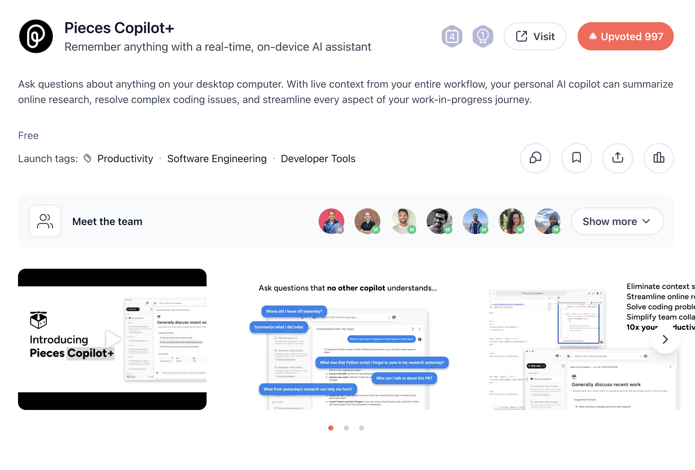

<Frame></Frame>

Studio1 helps teams plan and execute high-impact Product launches—combining content, community, and live activation to maximize visibility and conversions.

## What We Do

<Columns cols={2}>
  <Card title="Pre-Launch Strategy" icon="map">
    Positioning, messaging, assets checklist, and community readiness to ensure
    day-one momentum
  </Card>
  <Card title="Launch-Day Playbook" icon="rocket">
    Coordinated posting schedule across X, LinkedIn, Reddit, and communities;
    live engagement and rapid response
  </Card>
  <Card title="Content Engine" icon="pen-fancy">
    Technical write-ups, hands-on tutorials, and opinion pieces that resonate
    with developers
  </Card>
  <Card title="Creator & Community Amplification" icon="users">
    Organic amplification via creators and relevant communities; post framing
    support for founders
  </Card>
  <Card title="Reddit & HN Framing" icon="comments">
    Thoughtful post framing for Reddit and Hacker News; subreddit discovery and
    timing guidance
  </Card>
  <Card title="Live Demos & Spaces" icon="microphone">
    Optional live coding/demo sessions, spaces, and streams to engage users in
    real-time
  </Card>
</Columns>

## Activities We Can Support

- Short-form product videos that demonstrate key value
- Developer-focused tutorials and "how-to" articles
- Cross-platform launch posting and timing playbooks
- Founder post framing for Product Hunt, Reddit, and Hacker News
- Subreddit discovery, posting calendar, and moderation guidance
- Creator coordination for authentic amplification
- Live demos, streams, and AMA-style sessions
- Post-launch follow-up content to convert new users

## Launch Process (steps)

<Steps>
  <Step title="Pre-Launch (2–3 weeks)">
    <li> Define positioning, one-liner, and launch messaging </li>
    <li>
      {" "}
      Prepare asset checklist: screenshots, demo video, badges, pitch copy{" "}
    </li>
    <li> Outreach to creators and community champions for early support </li>
    <li> Schedule dry-run and final posting cadence</li>
  </Step>
  <Step title="Launch Day">
    <li>
      {" "}
      Coordinate simultaneous posts across X, LinkedIn, and
      Discord
    </li>{" "}
    <li>
      {" "}
      Live monitoring and rapid engagement playbook (replies, DMs, fixes)
    </li>{" "}
    <li> Amplify via creators and founders with ready-to-post snippets</li>
  </Step>
  <Step title="Post-Launch (1–2 weeks)">
    <li> Publish follow-ups: deep dives, tutorials, onboarding content</li>{" "}
    <li> Nurture new users and convert interest into trial/signups</li>{" "}
    <li> Measure impact (traffic,referrals, conversions) and iterate</li>
  </Step>
</Steps>

## Launch-Day Support

- Social mentions and coordinated threads on launch day
- Cross-channel link sharing (X, Discord, WhatsApp, communities)
- Real-time monitoring, community engagement, and DM outreach

## Case Study — Pieces Copilot+

<Frame></Frame>

Using Studio1’s launch framing, creator amplification, and developer-first content,
Pieces Copilot+ earned Product Hunt “Product of the Day.” We orchestrated
coordinated creator posts, hands-on tutorials, and targeted community outreach to
drive high-quality engagement and post-day momentum.

<Check>
  Outcomes: Product of the Day visibility, credible creator lift, and meaningful
  developer signups.
</Check>

We’ve also supported launches for teams like WebCrumbs and Permit.

## Testimonial

<Card title="Client feedback" icon="">
  "Arindam delivered a masterclass on launching on Product Hunt. We placed 3rd
  on our first launch with almost no preparation. He writes technical content
  that reaches engaged developers — we’ll definitely work with him again."
  —Julia, Founder, WebCrumbs
</Card>

## Get Started

<Card
  title="Plan Your Product Launch"
  icon="arrow-right"
  href="mailto:contact@studio1hq.com"
  horizontal
>
  Talk to us about timelines, campaign scope, and how we can tailor support for
  your launch
</Card>
